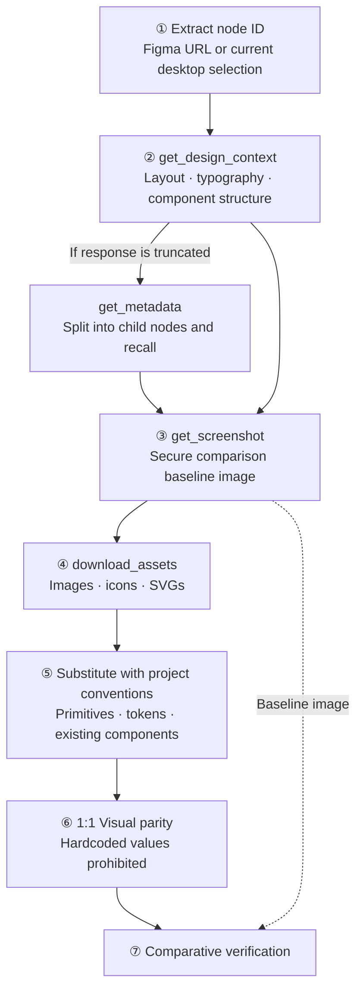
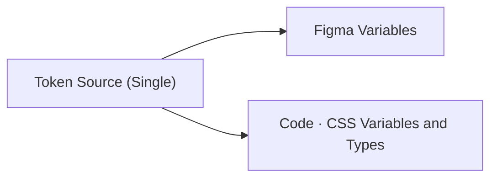

Last May, I had the experience of launching an e-commerce service at my company within a real development period of 2-3 months. In that process, we actively used Figma MCP to rapidly produce designs.

The results were not good. Layouts were severely broken, and alignments were all off. Fonts were applied differently to each node. Even when requesting the same screen again, the results varied every time; sometimes a few nodes were missing, and other times font sizes were incorrect. Changing the model didn't help either. Ultimately, we concluded that Figma MCP was an unreliable method and gave up on it. We didn't fully understand what the problem was at the time.

Recently, as we launched and refined our service, we began building a design system and adding new designs. Our team is working closely with the design team to create an environment where Figma can be properly utilized with LLMs.

In this process, I'd like to summarize what I've investigated regarding how to use Figma effectively.

## What Figma Provides

Figma provides various tools and prompts through MCP to read/write Figma files, along with extensive content such as skills, plugins, and guide documents for correct tool usage.

Among these, I focused my research on the content necessary for development.

### 1. MCP

These are Figma MCP tools that LLMs can use to retrieve Figma contexts. The full list is available in [Tools and prompts](https://developers.figma.com/docs/figma-mcp-server/tools-and-prompts).

**Tools for Retrieving Designs**

- `get_design_context`: Returns selected nodes as structured code context (React+Tailwind format)
- `get_metadata`: Returns an XML tree. Used for understanding the overall structure and breaking down large frames into child nodes.
- `get_screenshot`: Visual reference. A baseline for comparative verification after implementation.
- `get_variable_defs`: Variables/tokens (color·spacing·typography) used in the selected area.
- `download_assets`: Exports original images·icons·SVGs.
- `get_motion_context`: Keyframe animation data (for motion implementation).

If the selected context is too large, the `get_design_context` response will be truncated. Therefore, you first use `get_metadata` to grasp the overall structure and then delve into it again at the child node level.

**Code Connect Tools** ([Code Connect integration](https://developers.figma.com/docs/figma-mcp-server/code-connect-integration))

- `get_code_connect_map`: Retrieves Figma instance ↔ code component mappings.
- `get_code_connect_suggestions`: Detects unmapped components.
- `get_context_for_code_connect`: Defines properties for mapping creation (TEXT / BOOLEAN / VARIANT / INSTANCE_SWAP / SLOT).
- `add_code_connect_map`, `send_code_connect_mappings`: Registers and confirms mappings.

**Design System Lookup**

- `search_design_system`: Searches for components·variables·styles in libraries.
- `get_libraries`: Libraries linked to/linkable from the file.

**Prompts**

- `create_design_system_rules`: A reference prompt that explains how to structure Figma rule files.

### 2. Plugins

```plain text
claude plugin install figma@claude-plugins-official
```

Figma provides plugins to correctly use the tools described above. Installation instructions are available in [Claude Code and Figma: Set up the MCP server](https://help.figma.com/hc/en-us/articles/39888612464151-Claude-Code-and-Figma-Set-up-the-MCP-server), and the full list of skills is organized in [Figma skills for MCP](https://help.figma.com/hc/en-us/articles/39166810751895-Figma-skills-for-MCP).

The plugin offers various skills that dictate when and how to use these tools.

**skills**

- `figma-implement-design`: Design → Production code. Enforces a 7-step sequence.
- `figma-design-to-code`: Implementation guide for reading direction.
- `figma-implement-motion`: Motion/animation implementation.
- `figma-code-connect-components`: Entry point for discovering, approving, and attaching mapping targets. 4 steps.
- `figma-code-connect`: `.figma.ts` template creation·verification. 6 steps.
- `create-design-system-rules`: Skill version of the above prompt.
- `figma-swiftui`: iOS only.

What we need to examine closely is **the implementation flow enforced by the `figma-implement-design` skill.**

The 7 steps fixed by the skill and which tools are called at each step are as follows. The original text can be found in [Skill: figma-implement-design](https://developers.figma.com/docs/figma-mcp-server/skill-figma-implement-design).



**Things Easily Missed in Each Step**

- Step 2: If the response is truncated, narrow the scope. If the design is complex or has many nested layers, it gets cut off. In such cases, use `get_metadata` to get a map and request only the necessary nodes again.
- Step 3: The screenshot is for verification. Keep it accessible throughout implementation, but do not read the structure from it. The structure is provided by `get_design_context`.
- Step 4: Assets are fourth. If [localhost](http://localhost/) sources come, use them as is; do not install new icon packages or create placeholders. The necessary assets are already within the response.
- Step 5: The React + Tailwind provided by MCP is not the final code. The agent is trained on web-based data, so it provides it in a familiar form to facilitate translation; it's closer to an intermediate representation than an output format. It's our job to translate it into our framework and tokens.
- Step 7: Before completion, verify with a checklist: layout, typography, colors, interaction states, responsive behavior, asset rendering, accessibility.

The last line of the skill's Prerequisites states that it is desirable to have an established design system or component library in the project. Step 5 instructs to substitute with project tokens, Step 6 to avoid hardcoded values, and Implementation Rules to extend existing components if a suitable one exists, rather than creating new ones. Without a design system, these rules cannot be followed in the first place.

## How Should a Figma File Be Structured?

No matter how accurately development follows the above flow, what enters that flow is determined by the Figma file. The official documentation [Structure your Figma file for better code](https://developers.figma.com/docs/figma-mcp-server/structure-figma-file) recommends seven practices.

- Component Usage: Everything repetitive, like buttons, cards, inputs, and navigation items, should be components. Otherwise, they come as layer groups, and the agent determines reusability.
- Code Connect Integration: The most reliable way to achieve consistent component reuse. Without it, the model guesses.
- Define Tokens as Variables: Apply variables to spacing, color, radius, typography. Otherwise, raw values come, and the agent determines which token it is.
- Meaningful Layer Names: Use `CardContainer`, `ProductImage`, `CTA_Button` instead of `Frame1268`, `Group5`. Otherwise, it becomes a guessing game to connect what we say with the frames on the screen.
- Auto Layout: Avoid absolute positioning and convey layout intent. Otherwise, coordinates come, and the layout intent must be reverse-engineered.
- Annotation: Convey behavior, alignment, and responsiveness that are difficult to capture with visual information alone.
- Dev resources: Development resource links attached to layers in Dev Mode.

Among these, the need for meaningful layer names was particularly striking. It's said that being able to correctly infer the screen structure by just looking at the `get_metadata` response through meaningful layer names is crucial.

| Principle                          | Bad Example                       | Good Example                       |
| :--------------------------------- | :-------------------------------- | :--------------------------------- |
| Role, not appearance               | Gray Box, Left Area, Rectangle 3  | ProductInfo, OrderSummary          |
| Name matches if it corresponds to code | Card1                             | ProductCard (same as code component name) |
| Layout containers combine role and type | Frame 428                         | CheckoutSummarySection             |
| State as variant, not name         | Button_disabled separate frame    | Button component variant           |
| Decorative elements also named, but distinct | Group 12                          | DecorativeDivider                  |

Names based on appearance become false information the moment the design changes. If it's no longer gray, a name like 'Gray Box' is worse than useless.

## Where Inference Accumulates

If Figma is correctly configured, the Figma file is the answer key. Then, the development task is to translate that answer key into our code's representation and reconstruct it. The contents explained above are ultimately processes to minimize the agent's inference steps.

Here, a distinction arises: **what can be transferred as-is without inference** and **what needs to be translated into our code**. The former refers to values and components defined in Figma, while the latter is the process of translating the output provided by MCP into our conventions.

### Data Requiring No Inference

**Receiving the Response Directly into Our Codebase**

When Code Connect is applied, the `get_design_context` response includes code information. With the node ID as the key, the component name, file path, import statement, and usage snippet are returned together.

```json
{
  "1:2345": {
    "codeConnectName": "Button",
    "codeConnectSrc": "src/components/ui/Button.tsx"
  }
}
```

Mapped nodes come wrapped like this within the response. While the surrounding layout still comes in Tailwind, our component, along with its import statement, is present in place of a raw `div`.

```typescript
import { Button } from "@/components/ui/Button";

<div className="flex gap-[12px] items-center justify-center px-[var(--unit/10,10px)]">
  <CodeConnectSnippet data-name="Button" data-snippet-language="tsx">
    <Button variant="primary" size="md">Confirm</Button>
  </CodeConnectSnippet>
</div>
```

Without mapping, the agent looks at the node and creates something similar, differently each time. With mapping, `src/components/ui/Button.tsx` is written in the response. It becomes a target to call, not a target to create.

Rule documents handle the same instruction as sentences, while Code Connect handles it as data. Sentences induce action, while data eliminates choices.

**Tokens**

Colors·spacing·radii·typography already have names assigned to their values. Moving a named value is closer to a transfer than a translation.

Using a tool like [Tokens Studio](https://tokens.studio/) places token definitions in an external source rather than within Figma. Figma receives that source and reflects it as variables, and development also receives the same source to create CSS variables and types.



If one place is modified, both sides move together. There is little room for inference in this section.

**Components**

Components are trickier than tokens. Nevertheless, if they are design system components, they are still data that doesn't require an inference step. While the conversion process may not be simple, tools that attempted a static approach already existed in an open-source project called [DirectedEdges/specs](https://github.com/DirectedEdges/specs). These are provided as a Figma plugin and CLI([`@directededges/specs-cli`](https://www.npmjs.com/package/@directededges/specs-cli)), with a separate shared schema ([`@directededges/specs-schema`](https://www.npmjs.com/package/@directededges/specs-schema)). It explains that evaluation and difference calculation based on Figma styles and layers start from the premise that they are mechanical and predictable, so extraction is done via scripts, and only truly inference-requiring aspects like behavior, accessibility, and motion are passed downstream.

The differences from the agent-based approach are summarized as follows.

|     | Agent Extraction          | Static Extraction |
| --- | ------------------------- | ----------------- |
| Speed | 5-10 minutes per component | Seconds           |
| Cost  | 25-100K tokens per component | 0                 |
| Consistency | Inference errors·omissions·overconfidence | Deterministic·repeatable |

Based solely on the description, it was identical to what I aimed to solve.

**Imported Form vs. Extracted Form**

When a single button is retrieved with MCP, it comes in this form.

```typescript
<div className="bg-[var(--color/surface/state/default,#131518)] flex gap-[12px]
                items-center justify-center px-[var(--unit/10,10px)] rounded-[var(--8,8px)]">
```

It's readable, and sufficient for creating a single screen. However, a component cannot be created from this response alone, as it lacks information on which properties are defined or what changes in different combinations.

When the same component is extracted with this tool, it comes out organized as static CSS values.

```css
.button {
  display: flex;
  justify-content: space-between;
  background: var(--color.surface.state.default);
  border-radius: var(--8);
  height: 40px;
  padding: 0 var(--unit.10);
}
```

The names called by this CSS are the tokens managed by a single source mentioned earlier. Tokens and components will refer to the same source.

While another conversion process would be necessary to extract it into a CSS library suitable for the team, it certainly seemed like an achievable area.

### What Requires Inference

Even after addressing all the above, there's still a remaining section. The rules apply in the final stage, the stage of translating the received code into our conventions. If the input arriving at that stage is already a static result, the amount of inference the rules need to perform will be reduced. Therefore, what's needed are essentially guidelines on how to translate it according to our coding conventions.

The skeleton of the rule file can be examined through the `create_design_system_rules` prompt guide provided by Figma MCP. It consists of five sections, largely overlapping with what has been discussed earlier in this article.

| Rule File Skeleton               | Areas already eliminated above                               | What remains for rules                                      |
| :------------------------------- | :----------------------------------------------------------- | :---------------------------------------------------------- |
| Figma MCP Integration Rules      | Skill enforces 7 steps                                       | —                                                           |
| Asset Handling Rules             | Step 4 dictates using [localhost](http://localhost/) sources as-is | —                                                           |
| Styling Rules                    | Both tokens and primitives are within the design system. No need to choose values or define forms. | —                                                           |
| General Component Rules          | Code Connect points to what's in the design system           | Where to place new creations in the codebase, how to name them, and how to export them |
| Project-Specific Conventions     | —                                                            | All                                                         |

By the time the LLM needs to infer, much of the data is already static. For General Component Rules, this includes questions like which folder to place files in, how to set up imports, how to differentiate between domain and common components, and where to put tests. These are all things Figma cannot and has no reason to answer, and they would need to be additionally specified.

## Conclusion

A good Figma file is ultimately one where the agent has nothing to infer. Tokens, Code Connect, and layer names might seem like distinct features, but they all serve to eliminate inference steps one by one.

This is also why it didn't work in May. While the code side had primitives and tokens, the Figma side lacked components and variables. Since mapping partners existed only on one side, Code Connect couldn't even start. Without auto-layout, coordinates were provided, and without layer names, it was a guess as to what those coordinates represented. The screens that came out differently each time were the result of inference piled upon inference. No matter how many rule documents were added, they only reached the final stage.

Recently, based on these rules, we've been configuring Claude plugins and working with the design team to structure design system components and improve their quality. Once it's somewhat complete, I'll write another retrospective post about the process.