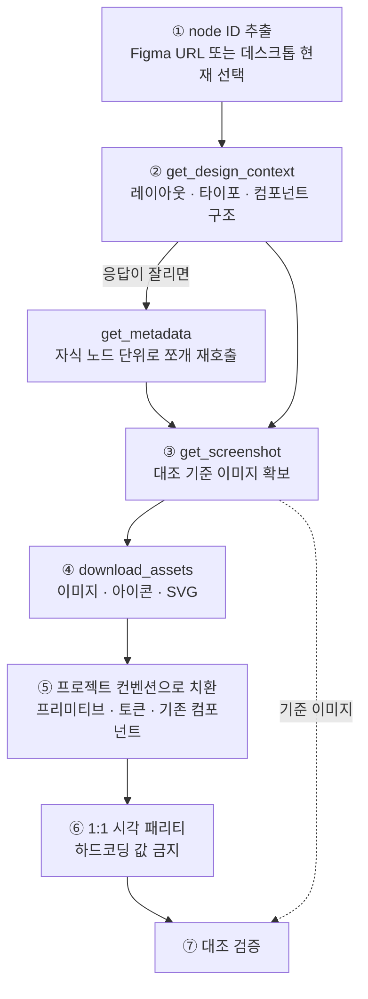
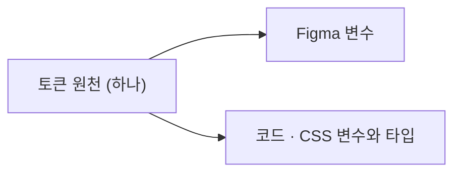

지난 5월 회사에서 실제 개발기간 2~3달만에 이커머스 서비스를 오픈하는 경험을 했었다. 그 과정에서 빠르게 디자인을 찍어내기 위해 Figma MCP를 적극적으로 사용했다.


결과는 좋지 않았다. 레이아웃이 심하게 깨지고 정렬이 다 어긋났다. 폰트가 노드마다 다르게 적용됐다. 같은 화면을 다시 요청해도 매번 결과가 달랐는데, 어떤 때는 노드를 몇 개 빠뜨리고 어떤 때는 폰트 사이즈가 어긋나는 식이었다. 모델을 바꿔봐도 마찬가지였다. 결국 Figma MCP는 신뢰할 수 없는 방법이라고 판단하고 손을 놓았다. 무엇이 문제였는지는 그때 제대로 알지 못했다.


최근 서비스를 오픈하고 고도화하면서 디자인 시스템을 구축하고 새로운 디자인들을 추가하게 됐다. 우리 팀은 LLM으로 Figma를 제대로 쓸 수 있는 환경을 만들고자 디자인팀과 긴밀하게 협업하고 있다.


이 과정에서 Figma를 어떻게 사용해야 할지 조사한 내용을 정리해보려고 한다.


## Figma가 제공하는 것


Figma는 MCP를 통해서 Figma를 read/write 할 수 있는 다양한 도구들과 프롬프트를 제공하고 있으며, 도구를 올바르게 사용하기 위한 skills, plugin, 가이드 문서 등 많은 내용들을 제공하고 있다.


이 중에서 개발할 때 필요한 내용들 위주로 조사해보았다.


### 1. MCP


llm이 Figma context들을 가져올 때 사용할 수 있는 Figma mcp 도구들이다. 전체 목록은 [Tools and prompts](https://developers.figma.com/docs/figma-mcp-server/tools-and-prompts)에 있다.


**디자인을 가져오는 도구들**

- `get_design_context`: 선택 노드를 구조화된 코드 컨텍스트(React+Tailwind 형태)로 반환
- `get_metadata`: XML 트리 반환. 전체 구조 파악과 큰 프레임을 자식 노드 단위로 쪼갤 때 사용
- `get_screenshot`: 시각 레퍼런스. 구현 후 대조 검증의 기준점
- `get_variable_defs`: 선택 영역에 쓰인 변수/토큰(color·spacing·typography)
- `download_assets`: 이미지·아이콘·SVG 원본 export
- `get_motion_context`: 키프레임 애니메이션 데이터(모션 구현 시)

선택한 context가 너무 크면 get_design_context의 응답이 잘리기 때문에, 먼저 get_metadata로 전체 구조를 잡고 자식 노드 단위로 다시 들어가게 된다.


**code connect 도구들** ([Code Connect integration](https://developers.figma.com/docs/figma-mcp-server/code-connect-integration))

- `get_code_connect_map`: Figma 인스턴스 ↔ 코드 컴포넌트 매핑 조회
- `get_code_connect_suggestions`: 매핑 안 된 컴포넌트 탐지
- `get_context_for_code_connect`: 매핑 작성용 프로퍼티 정의(TEXT / BOOLEAN / VARIANT / INSTANCE_SWAP / SLOT)
- `add_code_connect_map`, `send_code_connect_mappings`: 매핑 등록·확정

**디자인시스템 조회**

- `search_design_system`: 라이브러리에서 컴포넌트·변수·스타일 검색
- `get_libraries`: 파일에 연결된/연결 가능한 라이브러리

**프롬프트**

- `create_design_system_rules`: Figma 룰 파일을 어떤 식으로 구성해야 하는지 알려주는 참고용 프롬프트

### 2. 플러그인


```plain text
claude plugin install figma@claude-plugins-official
```


Figma에서는 위에서 설명한 도구들을 올바르게 사용하기 위해 plugin을 제공하고 있다. 설치 방법은 [Claude Code and Figma: Set up the MCP server](https://help.figma.com/hc/en-us/articles/39888612464151-Claude-Code-and-Figma-Set-up-the-MCP-server), 스킬 전체 목록은 [Figma skills for MCP](https://help.figma.com/hc/en-us/articles/39166810751895-Figma-skills-for-MCP)에 정리되어 있다.


plugin에서는 해당 도구들을 어떤 경우에 어떻게 사용해야되는지 다양한 스킬로 제공해주고 있다.


**skills**

- `figma-implement-design`: 디자인 → 프로덕션 코드. 7단계 순서를 강제
- `figma-design-to-code`: 읽기 방향 구현 가이드
- `figma-implement-motion`: 모션/애니메이션 구현
- `figma-code-connect-components`: 매핑할 대상을 발굴·승인하고 붙이는 진입점. 4단계
- `figma-code-connect`: `.figma.ts` 템플릿 작성·검증. 6단계
- `create-design-system-rules`: 위 프롬프트의 스킬 버전
- `figma-swiftui`: iOS 한정

우리가 중요하게 살펴볼 내용은 **figma-implement-design 스킬이 강제하는 구현 흐름이다.**


스킬이 고정하는 7단계와, 각 단계에서 어떤 도구가 불리는지는 아래와 같다. 원문은 [Skill: figma-implement-design](https://developers.figma.com/docs/figma-mcp-server/skill-figma-implement-design)에서 볼 수 있다.





**단계별로 놓치기 쉬운 것**

- Step 2: 응답이 잘리면 범위를 좁힌다. 디자인이 복잡하거나 중첩 레이어가 많으면 잘리는데, 그때 `get_metadata`로 지도를 받고 필요한 노드만 다시 요청한다.
- Step 3: 스크린샷은 검증용이다. 구현하는 내내 접근 가능하게 두되, 구조를 여기서 읽지는 않는다. 구조는 `get_design_context`가 준다.
- Step 4: 에셋은 네 번째다. [localhost](http://localhost/) 소스가 오면 그대로 쓰고, 새 아이콘 패키지를 설치하거나 플레이스홀더를 만들지 않는다. 필요한 에셋은 이미 응답 안에 있다.
- Step 5: MCP가 준 React + Tailwind는 최종 코드가 아니다. 에이전트가 웹 기반 데이터로 학습돼 있어서 익숙한 형태로 주면 번역이 쉬워지기 때문에 그 형태로 오는 것이고, 출력 포맷이라기보다 중간 표현에 가깝다. 우리 프레임워크와 토큰으로 옮기는 건 우리 몫이다.
- Step 7: 완료 전에 체크리스트로 검증한다. 레이아웃, 타이포, 색상, 인터랙션 상태, 반응형 동작, 에셋 렌더, 접근성.

스킬의 Prerequisites 마지막 줄에는 프로젝트에 확립된 디자인 시스템이나 컴포넌트 라이브러리가 있는 것이 바람직하다고 적혀 있다. Step 5는 프로젝트 토큰으로 치환하라 하고, Step 6은 하드코딩 값을 피하라 하고, Implementation Rules는 맞는 컴포넌트가 있으면 새로 만들지 말고 확장하라고 한다. 디자인 시스템이 없으면 애초에 지킬 수 없는 규칙들이다.


## Figma 파일은 어떻게 구성되어야 하는가


개발 쪽에서 위 흐름을 아무리 정확하게 따라도, 그 흐름에 무엇이 들어올지는 Figma 파일이 결정한다. 공식 문서 [Structure your Figma file for better code](https://developers.figma.com/docs/figma-mcp-server/structure-figma-file)는 일곱 가지를 권장한다.

- 컴포넌트 사용: 버튼, 카드, 인풋, 내비 아이템처럼 반복되는 것은 전부 컴포넌트로. 없으면 레이어 뭉치로 와서 재사용 여부를 에이전트가 판단한다
- Code Connect 연결: 일관된 컴포넌트 재사용을 얻는 가장 확실한 방법. 없으면 모델이 추측한다
- 변수로 토큰 정의: spacing, color, radius, typography에 변수 적용. 없으면 원시 값이 오고 어느 토큰인지는 에이전트가 정한다
- 의미 있는 레이어 이름: Frame1268, Group5 대신 CardContainer, ProductImage, CTA_Button. 없으면 우리가 말한 것과 화면의 프레임을 잇는 일부터 추측이 된다
- 오토레이아웃: 절대 위치를 피하고 레이아웃 의도를 전달. 없으면 좌표가 오고 배치 의도를 역산해야 한다
- Annotation: 시각 정보만으로는 잡기 어려운 동작, 정렬, 반응 방식을 전달
- Dev resources: Dev Mode에서 레이어에 붙인 개발 리소스 링크

이중에서 의미 있는 레이어 이름이 필요하다는 부분이 인상적이었다. 의미있는 레이어 이름을 통해서 `get_metadata` 응답만 보고 화면 구조를 올바르게 추론할 수 있냐가 중요하다고 한다.


| 원칙                    | 나쁜 예                      | 좋은 예                       |
| --------------------- | ------------------------- | -------------------------- |
| 생김새 말고 역할             | 회색 박스, 왼쪽 영역, Rectangle 3 | ProductInfo, OrderSummary  |
| 코드에 대응하면 이름 일치        | 카드1                       | ProductCard (코드 컴포넌트명과 동일) |
| 레이아웃 컨테이너는 역할과 종류를 함께 | Frame 428                 | CheckoutSummarySection     |
| 상태는 이름이 아니라 베리언트로     | Button_disabled 별도 프레임    | Button 컴포넌트의 베리언트          |
| 장식도 이름은 붙이되 구분되게      | Group 12                  | DecorativeDivider          |


생김새를 기준으로 붙인 이름은 디자인이 바뀌는 순간 거짓 정보가 된다. 회색이 아니게 되면 회색 박스라는 이름은 없느니만 못하다.


## 추론이 쌓이는 자리


Figma가 올바르게 구성돼 있다면 Figma 파일은 정답지다. 그러면 개발에서 하는 일은 그 정답지를 우리 코드의 표현으로 옮겨 정답지를 재구성하는 것이다. 지금까지 위에서 설명했던 내용들도 결국 에이전트가 추론하는 단계를 최대한 제거하는 과정이다.


여기서 갈래가 나뉜다. **추론 없이 그대로 옮겨도 되는 것**과, **우리 코드로 번역해야 하는 것**이다. 전자는 Figma에 정의돼 있는 값과 컴포넌트이고, 후자는 MCP가 준 출력을 우리 컨벤션으로 옮기는 과정이다. 


### 추론이 필요없는 데이터


**응답 자체를 우리 코드베이스로 받기**


Code Connect를 걸면 `get_design_context` 응답에 코드 정보가 실려서 온다. 노드 ID를 키로 컴포넌트 이름, 파일 경로, import 구문, 사용 스니펫이 함께 돌아온다.


```json
{
  "1:2345": {
    "codeConnectName": "Button",
    "codeConnectSrc": "src/components/ui/Button.tsx"
  }
}
```


매핑된 노드는 응답 안에서 이렇게 감싸져 온다. 주변 레이아웃은 여전히 Tailwind로 오지만, 그 자리에 원시 div 대신 우리 컴포넌트가 import 구문과 함께 들어와 있다.


```typescript
import { Button } from "@/components/ui/Button";

<div className="flex gap-[12px] items-center justify-center px-[var(--unit/10,10px)]">
  <CodeConnectSnippet data-name="Button" data-snippet-language="tsx">
    <Button variant="primary" size="md">확인</Button>
  </CodeConnectSnippet>
</div>
```


매핑이 없으면 에이전트가 노드를 보고 비슷한 걸 만든다. 매번 다르게. 매핑이 있으면 `src/components/ui/Button.tsx`라고 응답에 적혀서 온다. 만들 대상이 아니라 부를 대상이 된다.


같은 지시를 룰 문서는 문장으로, Code Connect는 데이터로 처리한다. 문장은 행동을 유도하고, 데이터는 선택지를 없앤다.


**토큰**


색·간격·반경·타이포는 값에 이름이 이미 붙어 있다. 이름이 있는 값을 옮기는 건 번역이라기보다 이동에 가깝다.


[Tokens Studio](https://tokens.studio/) 같은 도구를 쓰면 토큰 정의를 Figma 안이 아니라 바깥의 원천에 두게 된다. Figma는 그 원천을 받아 변수로 반영하고, 개발도 같은 원천을 받아 CSS 변수와 타입으로 만든다.





한 곳을 고치면 양쪽이 같이 움직인다. 이 구간에는 추론이 들어갈 여지가 별로 없다.


**컴포넌트**


컴포넌트는 토큰보다 까다롭다. 그래도 디자인 시스템 컴포넌트라면 추론 단계가 불필요한 데이터라는 점은 같다. 변환 과정이 간단하지는 않겠지만, [DirectedEdges/specs](https://github.com/DirectedEdges/specs)라는 오픈 소스에서 정적으로 접근을 시도했던 도구들이 이미 존재했다. Figma 플러그인과 CLI([`@directededges/specs-cli`](https://www.npmjs.com/package/@directededges/specs-cli))로 제공되며, 공유 스키마([`@directededges/specs-schema`](https://www.npmjs.com/package/@directededges/specs-schema))를 따로 두고 있다. Figma의 스타일과 레이어를 기준으로 한 평가와 차이 계산은 기계적이고 예측 가능하다는 전제에서 출발해, 추출은 스크립트로 하고 동작·접근성·모션처럼 정말 추론이 필요한 것만 하류로 넘긴다고 설명한다.


에이전트 방식과의 차이를 이렇게 정리해두고 있다.


|     | 에이전트 추출          | 정적 추출     |
| --- | ---------------- | --------- |
| 속도  | 컴포넌트당 5~10분      | 초 단위      |
| 비용  | 컴포넌트당 25~100K 토큰 | 0         |
| 일관성 | 추론 오류·누락·과신      | 결정적·반복 가능 |


설명만 봤을 때는 내가 해결하고자 한 내용과 동일했다.


**가져온 형태와 뽑아낸 형태**


MCP로 버튼 하나를 가져오면 이런 형태로 온다.


```typescript
<div className="bg-[var(--color/surface/state/default,#131518)] flex gap-[12px]
                items-center justify-center px-[var(--unit/10,10px)] rounded-[var(--8,8px)]">
```


읽기 좋고, 화면 하나를 만들 때는 이걸로 충분하다. 다만 이 응답만으로는 컴포넌트를 만들 수 없다. 어떤 프로퍼티가 정의돼 있는지, 다른 조합에서는 무엇이 달라지는지가 없기 때문이다.


같은 컴포넌트를 이 도구로 뽑으면 정적인 CSS 값으로 정리되어 나온다.


```css
.button {
  display: flex;
  justify-content: space-between;
  background: var(--color.surface.state.default);
  border-radius: var(--8);
  height: 40px;
  padding: 0 var(--unit.10);
}
```


이 CSS가 부르는 이름들이 앞에서 원천 하나로 관리한 그 토큰이다. 토큰과 컴포넌트가 같은 원천을 보게 된다.


팀에 맞는 css 라이브러리로 뽑으려면 또 컨버팅하는 과정이 필요하겠지만, 분명히 가능한 영역으로 보이기는 했다.


### 추론이 필요한 것


앞의 것들을 다 해도 남는 구간이 있다. 룰이 작용하는 곳은 마지막 구간, 받은 코드를 우리 컨벤션으로 옮기는 구간이다. 그 구간에 도착하는 입력이 이미 정적인 결과물이면 룰이 추론해야되는 수 있는 일은 그만큼 줄어들 것이라 사실상 우리 코드룰 컨벤션에 맞춰서 어떻게 옮길거냐에 관련된 내용들이 필요하다.


룰 파일의 골격은 피그마 MCP에서 제공해주는 `create_design_system_rules` 프롬프트 가이드를 통해서 살펴볼 수 있다. 다섯 덩어리인데, 이 글에서 앞서 다룬 것들과 상당 부분 겹친다.


| 룰 파일 골격                      | 앞에서 이미 없앤 자리                                            | 룰에 남는 것                                         |
| ---------------------------- | ------------------------------------------------------- | ----------------------------------------------- |
| Figma MCP Integration Rules  | 스킬이 7단계를 강제한다                                           | —                                               |
| Asset Handling Rules         | Step 4가 [localhost](http://localhost/) 소스를 그대로 쓰라고 못박는다 | —                                               |
| Styling Rules                | 토큰도 프리미티브도 디자인시스템 안에 있다. 값을 고르거나 형태를 정할 일이 없다           | —                                               |
| General Component Rules      | 디자인시스템에 있는 것은 Code Connect가 지목한다                        | 새로 만드는 것을 코드베이스 어디에 두고, 어떻게 이름 짓고, 어떻게 export할지 |
| Project-Specific Conventions | —                                                       | 전부                                              |


LLM이 추론해야되는 시점에는 이미 많은 부분이 정적인 데이터로 되어있는 상황이고 General Component Rules에 해당할만한 파일을 어느 폴더에 둘지, import를 어떻게 걸지, 도메인 컴포넌트와 공용 컴포넌트를 어떻게 가를지, 테스트를 어디에 둘지. 전부 Figma가 답할 수 없고 답할 이유도 없는 것들을 추가적으로 적어주면 될 것 같다.


## 마무리


좋은 Figma 파일이란 결국 에이전트가 추론할 게 없는 파일이다. 토큰도 Code Connect도 레이어 이름도 각자 다른 기능처럼 보이지만, 전부 추론할 단계를 하나씩 지우는 일이었다.


5월에 안 됐던 이유도 여기에 있다. 코드 쪽에는 프리미티브와 토큰이 있었지만 Figma 쪽에는 컴포넌트도 변수도 없었다. 매핑할 짝이 한쪽에만 있었으니 Code Connect는 시작할 수조차 없었고, 오토레이아웃이 없으니 좌표가 왔고, 레이어 이름이 없으니 그 좌표가 무엇인지부터 추측이었다. 추측 위에 추측이 쌓인 결과가 매번 다르게 나오던 그 화면들이었다. 그 위에 룰 문서를 아무리 얹어도 마지막 구간에만 닿았다.


최근에는 이런 룰을 베이스로 Claude 플러그인을 구성해서, 디자인팀과 함께 디자인 시스템 컴포넌트를 구성하고 품질을 높이는 데 힘쓰고 있다. 어느 정도 완성되면 그 과정도 회고하는 글로 또 써보겠다.

